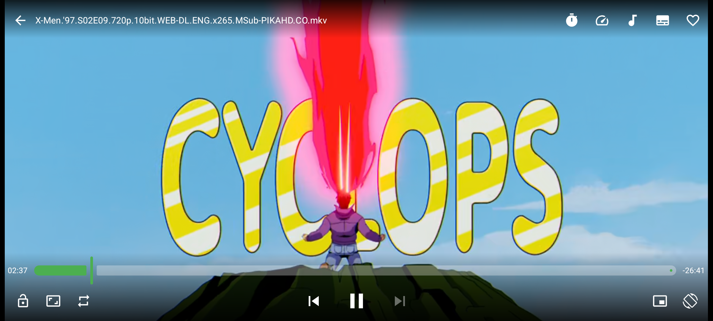

  

  # Z Player

  **A modern, fast Android media player built with card UI layouts and hero previews.**

  
  
  
  

   

  [📥 **Download Latest APK**](https://github.com/silenTKnight-sudo506/ZPlayer/releases/latest) • [✨ **Features**](#-key-features) • [📱 **Screenshots**](#-screenshots)

   

---

## 📌 Overview

**Z Player** replaces repetitive, text-heavy file managers with a sleek, card-driven media interface for local video and audio playback. Designed with performance and modern mobile aesthetics in mind, it provides low-latency playback alongside native drag and gesture shortcuts.

---

## ✨ Key Features

* **🎨 Modern Card-Driven UI:** Replaces plain text file trees with rich media cards and hero preview banners.
* **⚡ Hardware-Accelerated Playback:** Low CPU overhead ensuring smooth, high-bitrate media decoding.
* **📱 Touch & Gesture Shortcuts:** Intuitive drag controls for fast seeking, brightness, and volume adjustments.
* **📁 Visual Library Management:** Easily toggle between visual hero cards or quick structured folder access.

---

## 📱 Screenshots

  
  

  
  

  

---

## 🚀 Installation

1. Go to the [**Releases**](https://github.com/silenTKnight-sudo506/ZPlayer/releases) section.
2. Download the latest `.apk` file (e.g., `ZPlayer-v1.0.1.apk`).
3. Install the APK on your Android device.

---

Made with ❤️ by [silenTKnight](https://github.com/silenTKnight-sudo506)

