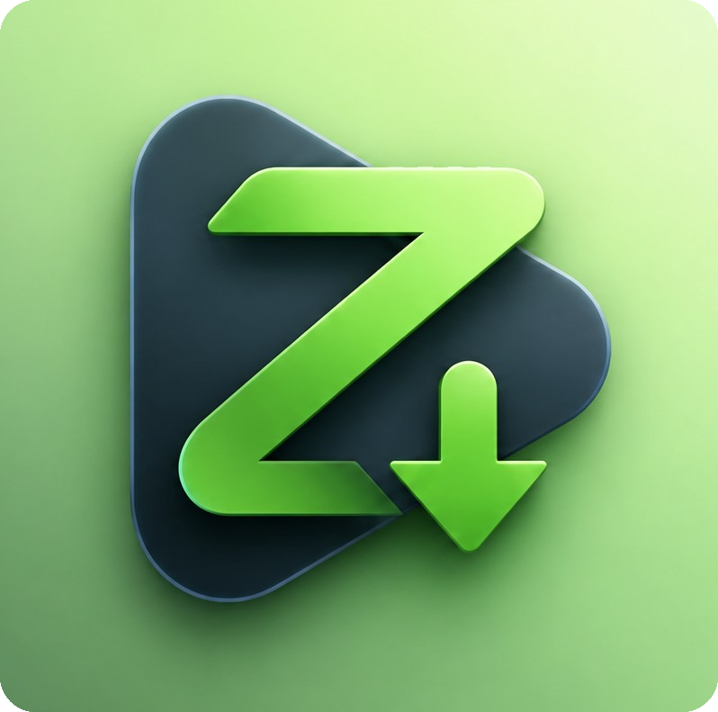
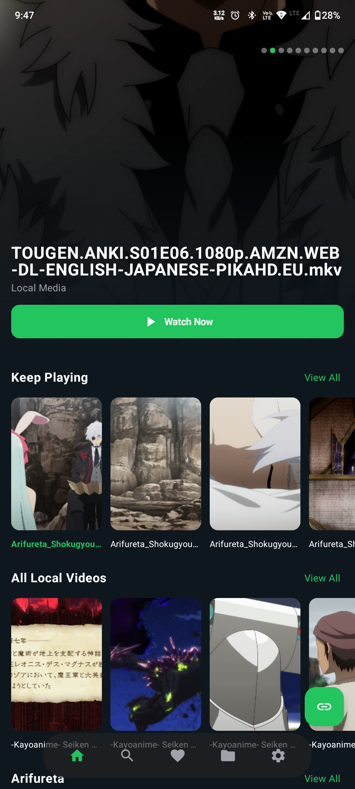
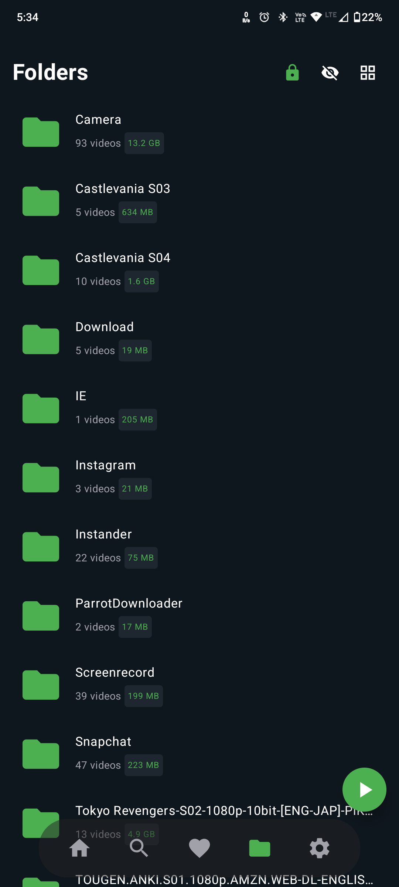
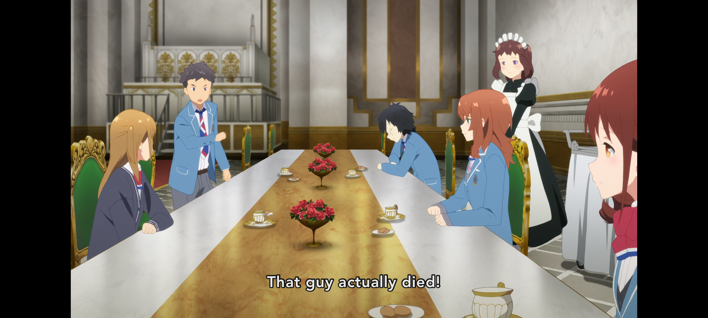
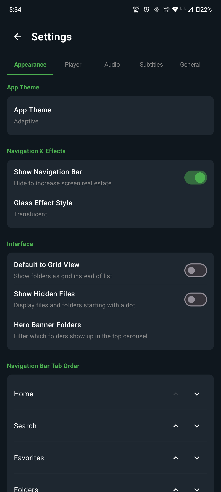

  

  # Z Player

  
  
  

  A lightweight, high-performance media player built for smooth video playback, custom layouts, and rapid controls.

  [📥 Download App](#-downloads) • [✨ Features](#-key-features) • [🖼️ Screenshots](#-screenshots--ui-preview)

---

## Overview 🌌

Z Player is an **Android**-first media application built for high-performance playback without unnecessary background overhead. The app handles local storage indexing, media playback acceleration, and customizable interface controls directly on-device.

> Z Player is built for users who want total control over their media experience without sacrificing system resources.

At a glance:

* **Hardware-accelerated playback** for high-bitrate media
* **Clean, modern dark UI** optimized for mobile navigation
* **Native gesture controls** for rapid seeking and volume adjustment

---

## What makes Z Player different ✨

Z Player drops unnecessary bloat to focus on pure playback speed and interface clarity. Designed for media enthusiasts who want total control without high system resource usage.

## Feature atlas 🚀

| Feature | Description |
| :--- | :--- |
| **⚡ High Performance** | Minimal memory footprint and hardware-accelerated decoding. |
| **🎨 Sleek Design** | Clean modern dark shell with adaptive playback controls. |
| **⌨️ Quick Gestures** | Full set of customizable keyboard shortcuts and touch gestures. |
| **📁 Universal Formats** | Native support for all major audio and video containers. |

---

## Screenshots / UI preview 🖼️

  
  

    

  
  

    

  

---

## 📥 Downloads

Get the latest stable release for your platform directly from our GitHub Releases page:

  

---

  Distributed under the MIT License.

