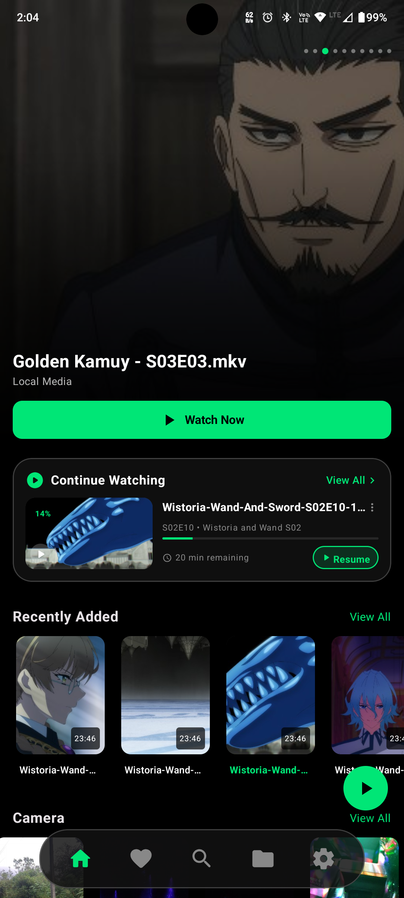
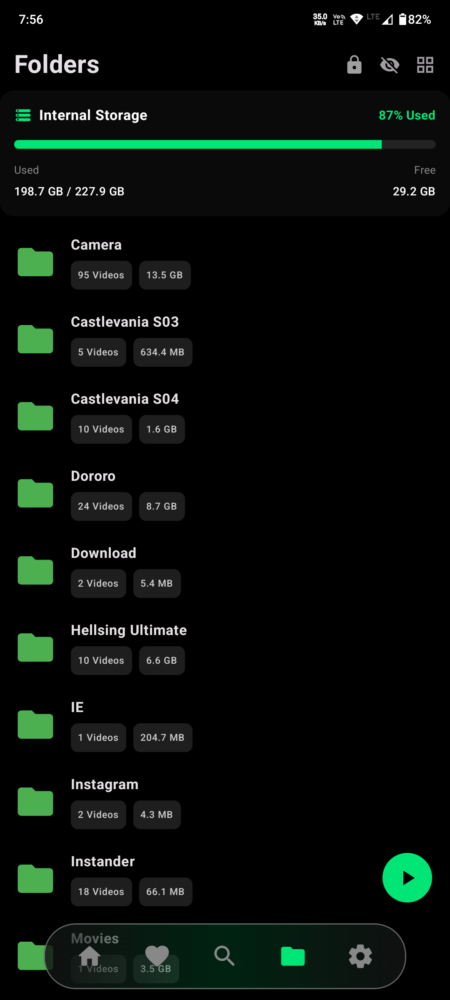
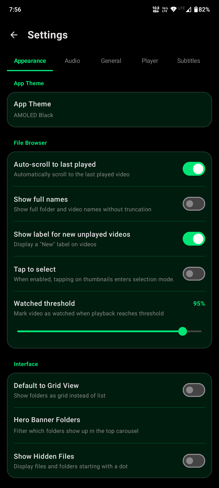
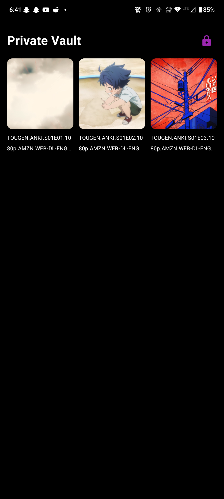

  

  # Z Player

  **A modern, fast Android media player built with card UI layouts and hero previews.**

  
  
  
  
  

   

  [📥 **Download Latest APK**](https://github.com/silenTKnight-sudo506/ZPlayer/releases/latest) • [✨ **Features**](#-key-features) • [📱 **Screenshots**](#-screenshots)

   

---

## 📌 Overview

**Z Player** replaces repetitive, text-heavy file managers with a sleek, card-driven media interface for local video and audio playback. Designed with performance and modern mobile aesthetics in mind, it provides low-latency playback alongside native drag and gesture shortcuts.

---

## ✨ Key Features

* **🎨 Material 3 & Custom Theming:** A beautiful card-driven UI with frosted glass effects, hero preview banners, and Adaptive System dynamic colors.
* **⚡ Instant Gapless Playback:** Powered by the latest Media3 ExoPlayer with smart keyframe snapping for zero-delay video transitions and hardware-accelerated decoding.
* **📱 Advanced Gesture Controls:** Intuitive drag controls for fast seeking, brightness, volume adjustments, and 0.25x increment long-press playback speeds.
* **📺 Picture-in-Picture & Multitasking:** Seamless PiP support and an intelligent "Play in Call" audio routing system.
* **📁 Smart Library Management:** Features background media caching, customizable bottom navigation, and full support for viewing hidden files and dot-folders.
* **🗣️ Multi-Track & Subtitles:** Built-in support for multiple audio tracks and fully customizable, syncable subtitle tracks.

---

## 📱 Screenshots

  
  

  
  

  
  

---

## 🚀 Installation

1. Go to the [**Releases**](https://github.com/silenTKnight-sudo506/ZPlayer/releases) section.
2. Download the latest `.apk` file.
3. Install the APK on your Android device.

---

  
**If you found this project helpful, please consider giving it a ⭐ Star.**
 
  
Made with ❤️ by [silenTKnight](https://github.com/silenTKnight-sudo506)

